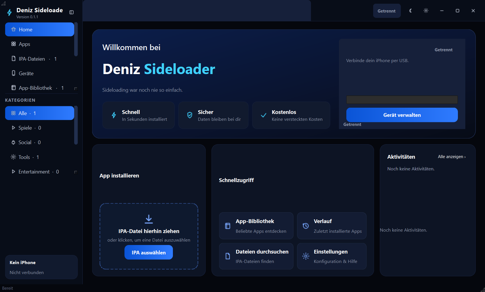
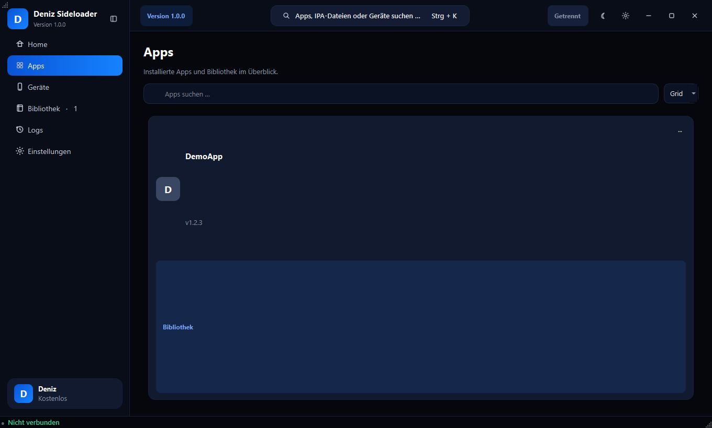

# Deniz Sideloader

> A modern open-source desktop application for managing and legitimately sideloading IPA applications to your own iPhone.

[](https://github.com/dbudakli1402-collab/DenizSideloader/actions/workflows/ci.yml)
[](LICENSE)
[](https://github.com/dbudakli1402-collab/DenizSideloader/releases)




## Features

- **Home-Dashboard** — Hero, Gerätestatus mit Speicher/Akku, Drag-&-Drop-Installer, Schnellzugriff, Aktivitäten
- **Apps** — installierte + Bibliotheks-Apps mit Status (Grid/Liste, Suche, Details)
- **IPA-Dateien** — Import, Drag & Drop, Suche, Filter, Sortierung, Kontextmenü (Installieren, Umbenennen, Ordner öffnen, Kategorie, Löschen)
- **Geräte** — USB-Erkennung, iOS-Version, Trust-Hinweise, echter Speicher/Akku, Serieninfos
- **App-Bibliothek** — Sammlung nach Kategorien (Alle, Spiele, Social, Tools, Entertainment, Produktivität, Bildung)
- **Downloads** — direkte IPA-URLs mit Fortschritt, Speed, ETA, Pause/Fortsetzen/Abbrechen, SHA-256, Auto-Import
- **Verlauf** — Timeline aller Installationen, Downloads, Geräteereignisse und Fehler (filterbar)
- **Globale Suche** — `Strg + K` über Apps, Dateien und Geräte
- **Installation** — Select → Analyze → Detect → Signing → Install → Verify → Done, mit Live-Dialog
- **Signierung** — kostenlos (7 Tage) / bezahlt / lokale Profile; Passwörter werden nie gespeichert
- **Mitteilungen** — animierte Toasts (Erfolg/Fehler/Info)
- **Einstellungen** — Allgemein, Gerät, Installation, Mitteilungen, Erweitert, Über (komplett deutsch)
- Dark Navy Premium-Design mit Hell/Dunkel-Umschalter, einklappbarer Sidebar, Tastaturkürzel (`Strg+K`, `Strg+1–8`, `Esc`)

## Requirements

- Windows 10/11, Python 3.10+
- iPhone with USB data cable
- Apple Mobile Device support: iTunes (apple.com) or Apple Devices app
- For real installs: the device backend (pymobiledevice3) is bundled; just add your own signing assets

## Installation (Benutzer)

Auf der [Release-Seite](https://github.com/dbudakli1402-collab/DenizSideloader/releases) gibt es zwei Varianten:

- **DenizSideloader-x.y.z-Setup.exe** — Installer mit Assistent (Startmenü, Deinstallation, keine Admin-Rechte nötig, installiert nach `%LOCALAPPDATA%\Programs\DenizSideloader`)
- **DenizSideloader-x.y.z-win64.zip** — portable Version: entpacken, `DenizSideloader.exe` starten

## Installation (aus dem Quellcode)

```powershell
cd DenizSideloader
python -m venv .venv
.\.venv\Scripts\Activate.ps1
pip install -r requirements.txt
python -m app
```

Build a console-free exe:

```powershell
pip install -r requirements-dev.txt
python scripts/build_exe.py   # -> release/DenizSideloader.exe
```

## iPhone setup

1. Connect via USB, unlock the iPhone.
2. Tap **Trust**, enter passcode.
3. Keep connected during installs. See `docs/windows-setup.md`.

## Apple Developer requirements

Free Apple ID: apps expire after ~7 days, few apps max, weekly re-install.
Paid membership: ~12-month validity. Details: `docs/signing.md`.
Your password is **never stored** — only a username hint goes to Windows
Credential Manager.

## Sideloading guide

1. Import an `.ipa` (Library → Import / drag & drop) or paste a direct URL (Downloads).
2. Go Home → **Choose IPA** (or Install in the Library).
3. Confirm the target iPhone → watch the progress dialog.
4. "Installation complete" → Done. Do not disconnect mid-install.

## What actually works today

| Area | Status |
| ---- | ------ |
| IPA parsing/metadata/library | ✅ real |
| Download manager + SHA-256 | ✅ real |
| Device detection (with backend + drivers + trust) | ✅ real |
| Signing-assets workflow | ✅ real (needs your profile) |
| On-device install | ✅ real when backend + assets present; otherwise **honest failure with steps** |
| Installed-apps listing | ✅ when backend supports it; otherwise labeled unavailable |

No fake-success buttons anywhere — see `docs/limitations.md`.

## Troubleshooting

| Symptom | Fix |
| ------- | --- |
| No iPhone found | unlock, Trust, cable/port, iTunes/Apple Devices |
| Trust required loop | reconnect, unlock first, then Trust |
| Signing incomplete | add `.mobileprovision` in Settings → Signing |
| 7-day expiry | free-account Apple policy, re-install |
| Download fails | must be a direct `https://…*.ipa` link |

Errors always show causes + Retry/Help; technical details under "Show details".

## Security

HTTPS-only downloads, cert validation, SHA-256, traversal/shell-injection
protections, redacted structured logs, OS-keychain-only hints, no telemetry.
Report issues privately per SECURITY.md. **Never paste passwords/tokens/keys
into issues.**

## FAQ

**Is this a jailbreak?** No. Only Apple's legitimate signing mechanism.
**Does it store my Apple password?** Never.
**Does it work without an iPhone?** Library/downloads/settings do; installs need hardware.
**Why "failed" instead of installing?** Missing backend/drivers/assets — the message tells you exactly what to add.

## Development

```powershell
pip install -r requirements.txt -r requirements-dev.txt
python -m pytest tests
python -m ruff check app tests
python -m ruff format --check app tests
python -m mypy app
$env:DENIZ_MOCK_DEVICES = "1"; python -m app   # simulated iPhone
```

Tech choice: **Python + PySide6 (Qt, native)** — no Chromium overhead, no
browser/localhost hack, builds with just pip. See `docs/architecture.md`.

## Build & Release

- CI (Windows): lint → format-check → typecheck → tests → secret scan → packaging smoke test.
- Tag `v*` triggers the exe build (`scripts/build_exe.py`) + artifact upload.
- Versioning: `app/__init__.py::__version__` (+ git tags for releases).

## Contributing / License

See CONTRIBUTING.md, CODE_OF_CONDUCT.md, SECURITY.md. License: MIT (LICENSE).
